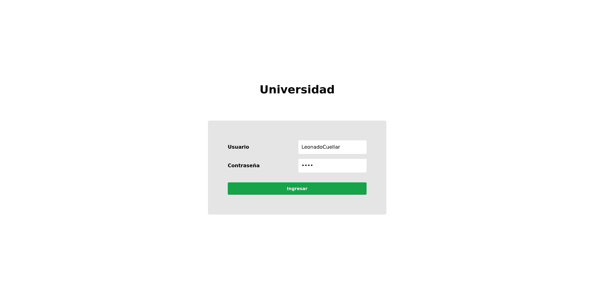
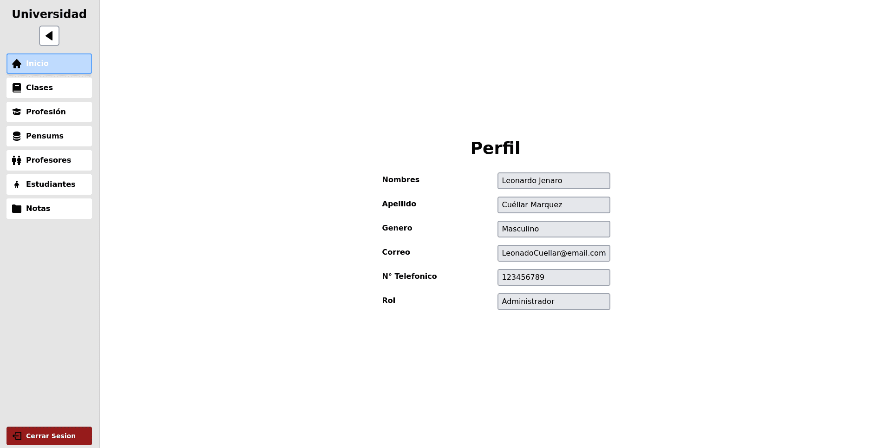
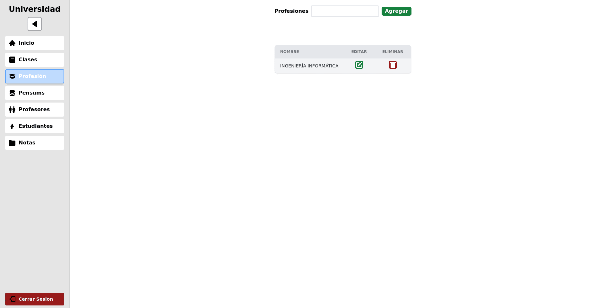
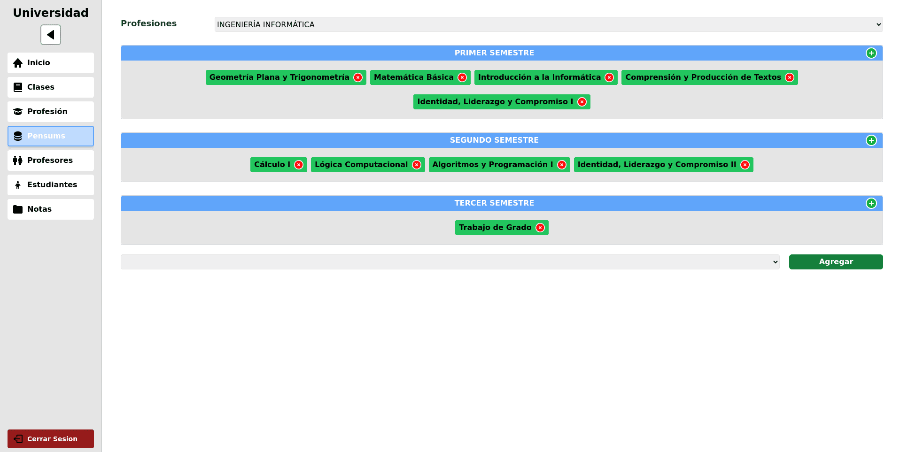
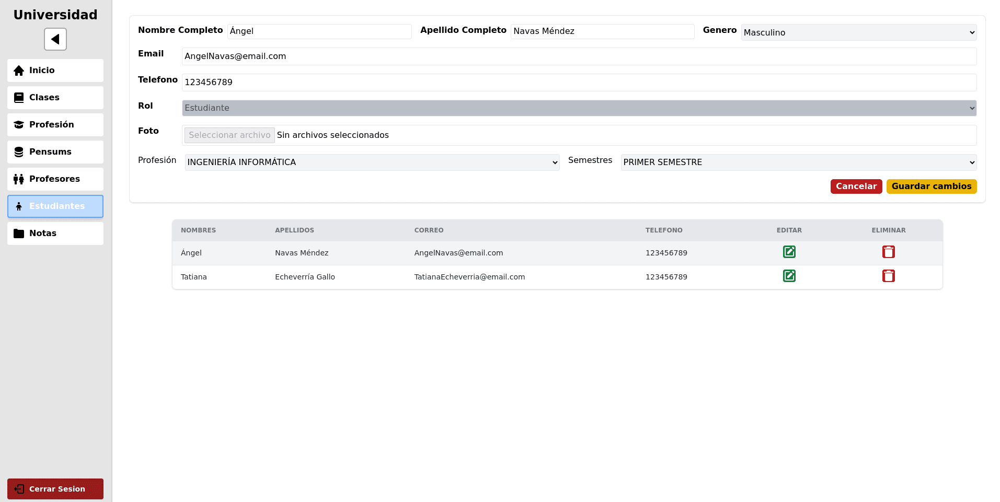
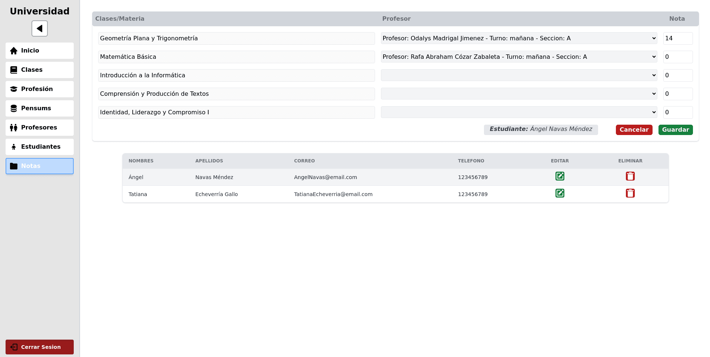
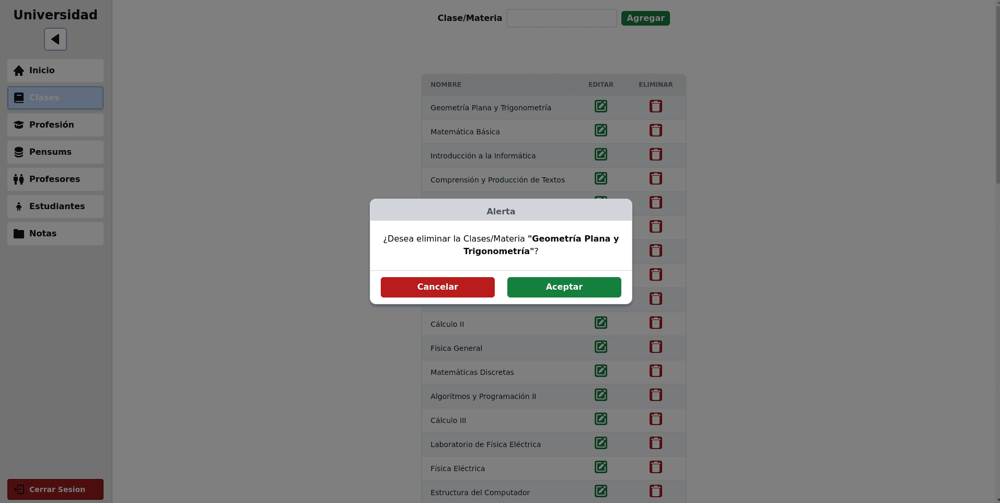
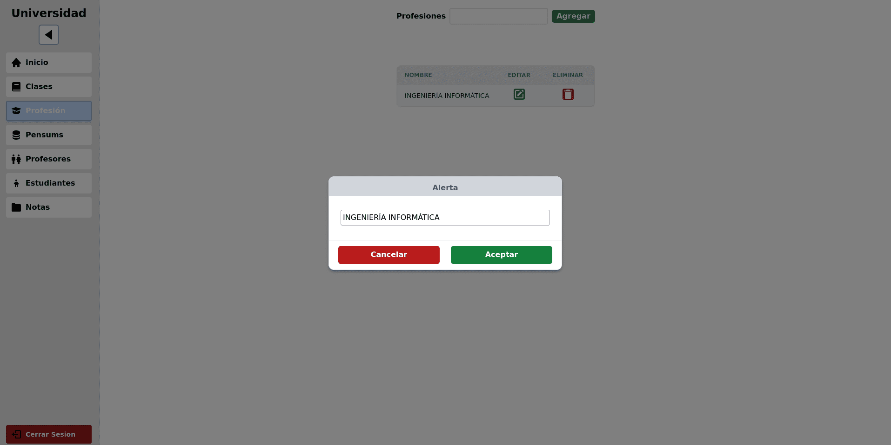
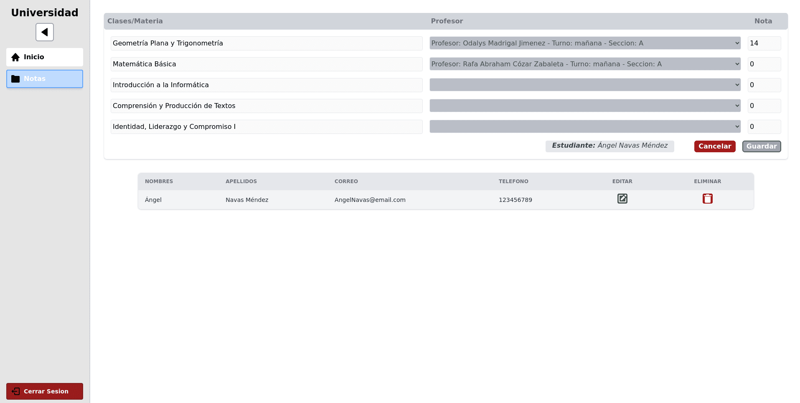

# Control de Estudio
Sistema administrativo universitario.

La aplicación gestionara las profesiones, materias, pensum, profesores, estudiantes y notas de los estudiantes.

El sistema cuenta con 3 tipos de roles (Administrador, Profesor y Estudiante).

Los permisos por roles son los siguientes:
- Administrador:
- - Clases (todos los permisos)
- - Profesión (todos los permisos)
- - Pensum (todos los permisos)
- - Profesor (todos los permisos)
- - Estudiante (todos los permisos)
- - Notas (Visualiza, edita)
- Profesor:
- - Notas (visualiza, edita)
- Estudiante:
- - Notas (visualiza)

## Funcionalidad
- Almacena todas las materias dadas independientemente de la profesiones.
- Almacena las profesiones impartidas en la universidad.
- Crea pensum con un limite máximo de 10 semestres y sin limites de asignación de materias por semestre.
- Almacena profesores con sus datos personales y se le asigna materia por profesión, semestre, sección y turno en que se imparte la clase, un profesor puede dar la misma materia en distintas turnos, semestres, profesiones y secciones, así mismo puede dar un numero ilimitado de materias.
- Almacena estudiante con los datos personales, profesión y semestre en curso.
- Almacena las notas del estudiante en las materias del semestre actual, siempre y cuando exista un profesor que imparta esa materia, en esa profesión, puede existir mas de un profesor impartiendo la materia, en distintos turnos y secciones.


## Objetivo
Este proyecto fue iniciado con la finalidad de practicar y aprender el uso de herramientas para el desarrollo de aplicaciones Webs tanto en Front-End y Back-End.

## Tecnologías
- TaildWind
- React
- Zustand
- GraphQL
- Express
- JWT
- Autenticación
- Autorización
- Planificación

## Requerimientos
- XAMPP (MySQL)
- NodeJs
- Navegador Web

## Uso
- Crea una carpeta donde guardar el proyecto
- Abre la terminar y diríjase a la carpeta que creaste.
- Ejecuta el siguiente comando: `git clone https://github.com/Marco90v/ControlEstudio.git`
- Inicie el servidor SQL, si tiene instalado XAMPP ejecute XAMPP.
- Cree una Base de Datos con el nombre `controlestudio`
- Agregue el usuario `admin` y contraseña `admin` o si prefiere diríjase a la carpeta del proyecto `BackEnd > src > services > conect.ts` y reemplaze los datos de coneccion.
- Desde la terminar navegue a la carpeta del proyecto, luego entre a la carpeta BackEnd e instale todas las dependencias con `yarn install`
- IMPORTANTE: en la carpeta backend debe crear un archivo .env y agregar una variable `SECRET` con el valor que desee, esto sera usado para crear el JWT, ejemplo: `SECRET=pass`
- Realice el paso anterior pero esta vez en la carpeta FrontEnd.
- En caso de error con TypeScript al abrir el area de trabajo en Visual Studio Code ejecute en la ruta de la carpeta frontend el siguiente comando `yarn dlx @yarnpkg/sdks vscode`
- Una vez instaladas todas las dependencias, desde cada carpeta por separada ejecute el comando `yarn dev`
- Al ejecutar el BackEnd se creara la base de datos, tablas, columnas y datos base, de manera automática para que pueda hacer uso del proyecto.

## Usuarios y contraseñas para iniciar sesion
```json
{
    "user":"LeonadoCuellar", "pass":"1234", "rol":"Administrador",
    "user":"AlmaFranco", "pass":"1234", "rol":"Administrador",

    "user":"RafaCozar", "pass":"1234", "rol":"Profesor",
    "user":"OdalysMadrigal", "pass":"1234", "rol":"Profesor",

    "user":"AngelNavas", "pass":"1234", "rol":"Estudiante",
    "user":"TatianaEcheverría", "pass":"1234", "rol":"Estudiante",
}
```

## Vista Previa del proyecto

- ### Login

- ### Inicio

- ### Clases


- ### Profesiones


- ### Pensums


- ### Profesores


- ### Estudiantes


- ### Notas


- ### Modal Eliminar


- ### Modal Editar


- ### Modal Agregar Clase en Pensum


- ### Modal Guardar Cambios


- ### Modal Alerta


- ### Vista Profesores


- ### Vista Estudiantes
